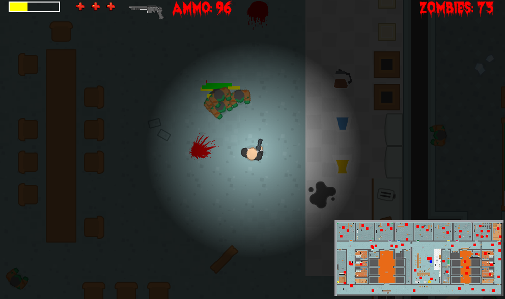
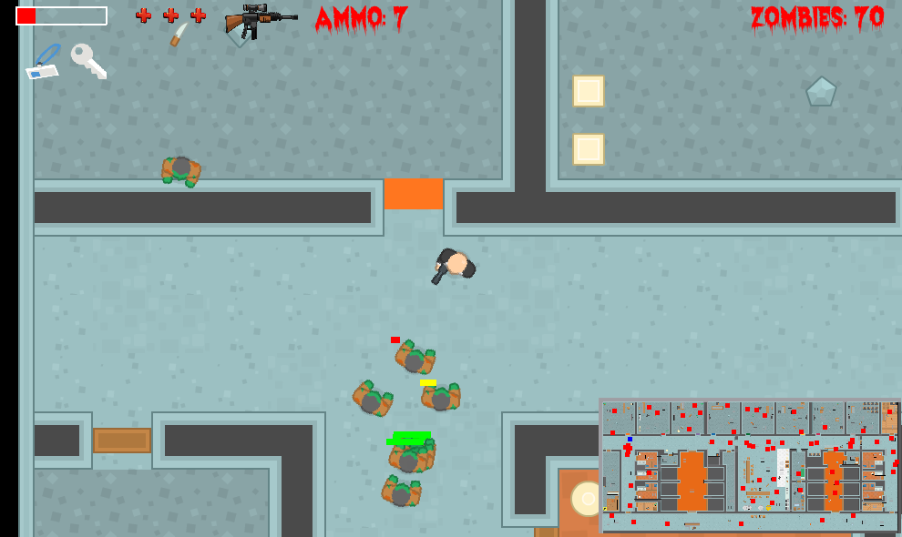

# The Curse of Aegis
The player is stuck in the island. He had been cursed during a storm and landed up on an island to save his life and break the curse. He needs ship fuel to sail back to his country. In search of the ship fuel he entered a haunted laboratory. The player/user needs to guide the sailor to find the fuel and return safely. Firstly the player can select among what type of level he want to play based on the hardness. The laboratory contains some compartments as well in which the sailor needs to kill the spirits in order to break the curse and return to his home. The laboratory consists of opened compartments and one locked compartment which require 3 keys to be opened. Player needs to find the keys to unlock it and finally when he has the ship's fuel bottle in his hand with one or more extra lives, he will succeed and win the game.

## How to run the Game
Create virtualenv and install all requirements and run command:
`python3 main.py`

## Keyboard Keys
The game is a solely keyboad based game. Following keys needs to be used:

W or UP arrow key       - To move Forward
S or DOWN arrow key     - To move Backward
D or RIGHT arrow key    - To move Right
A or LEFT arrow ley     - To move Left
M                       - To mute or unmute the sounds in the game
P                       - To pause the game
ESC                     - To quit the game

<!-- ## Screenshots -->
<!--  -->

<!--  -->